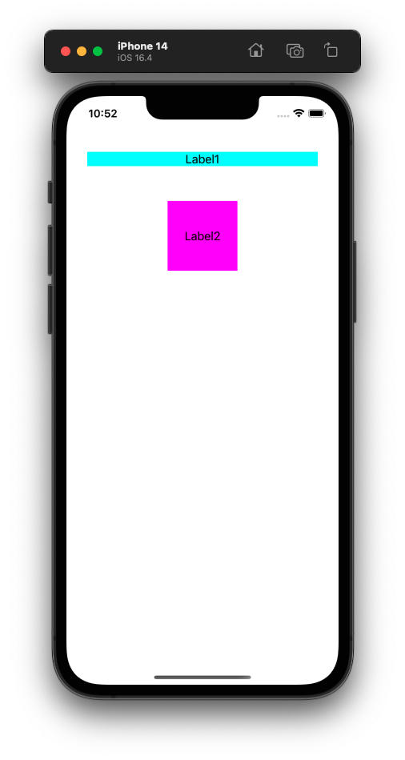

# PDLayout

簡化設定AutoLayout 步驟

不只設定更加便利，更讓您的代碼容易閱讀

***

```
// 可用參數

X -> CenterXAnchor
Y -> CenterYAnchor
T -> TopAnchor
L -> LeftAnchor
B -> BottomAnchor
R -> RightAnchor
W -> WidthAnchor
H -> HeightAnchor

eq -> Equal
ge -> GreaterThanOrEqual
le -> LessThanOrEqual
```

***

```
// 簡化前
let label1 = UILabel();
label1.text = "Label1";
label1.textAlignment = .center;
label1.backgroundColor = .cyan;

let label2 = UILabel();
label2.text = "Label2";
label2.textAlignment = .center;
label2.backgroundColor = .magenta;

view.addSubview(label1);
view.addSubview(label2);

label1.translatesAutoresizingMaskIntoConstraints = false;
label1.topAnchor.constraint(equalTo: view.topAnchor, constant: 80).isActive = true;
label1.leftAnchor.constraint(equalTo: view.leftAnchor, constant: 30).isActive = true;
label1.rightAnchor.constraint(equalTo: view.rightAnchor, constant: -30).isActive = true;

label2.translatesAutoresizingMaskIntoConstraints = false;
label2.centerXAnchor.constraint(equalTo: label1.centerXAnchor).isActive = true;
label2.topAnchor.constraint(equalTo: label1.bottomAnchor, constant: 50).isActive = true;
label2.widthAnchor.constraint(equalToConstant: 100).isActive = true;
label2.heightAnchor.constraint(equalToConstant: 100).isActive = true;
```

***

```
// 簡化後
let label1 = UILabel();
label1.text = "Label1";
label1.textAlignment = .center;
label1.backgroundColor = .cyan;

let label2 = UILabel();
label2.text = "Label2";
label2.textAlignment = .center;
label2.backgroundColor = .magenta;

view.addSubview(label1);
view.addSubview(label2);

label1
    .Teq(T: view, 80)
    .Leq(L: view, 30)
    .Req(R: view, -30)
    .end();

label2
    .Xeq(X: label1)
    .Teq(B: label1, 50)
    .Weq(100)
    .Heq(100)
    .end();
```

***



